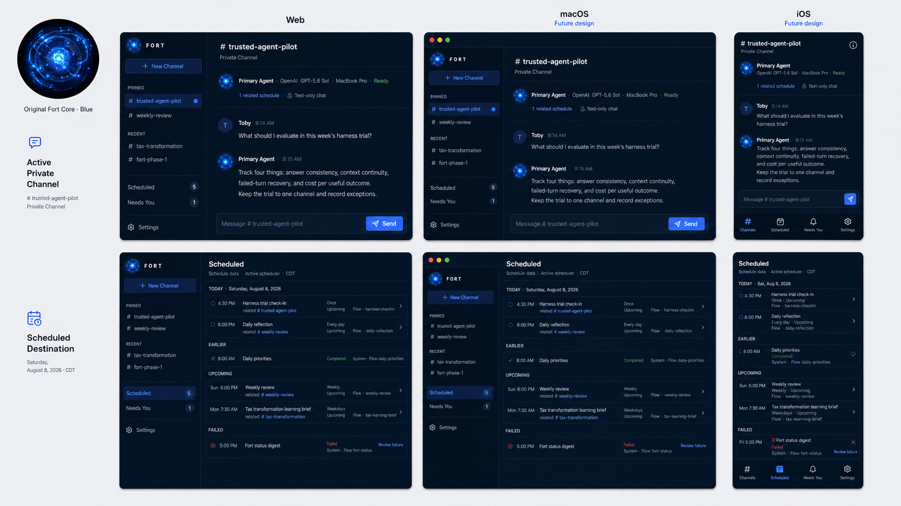
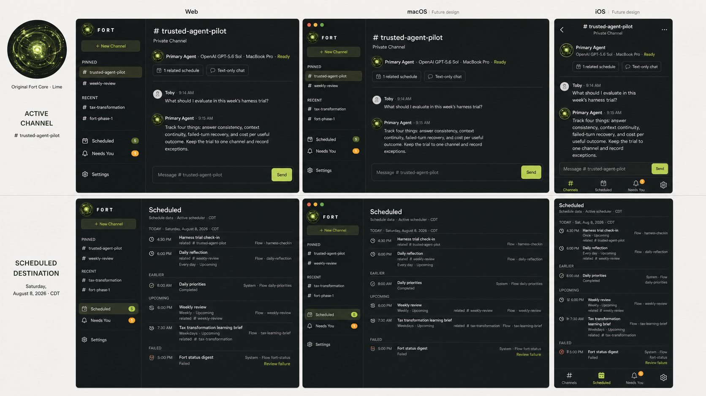
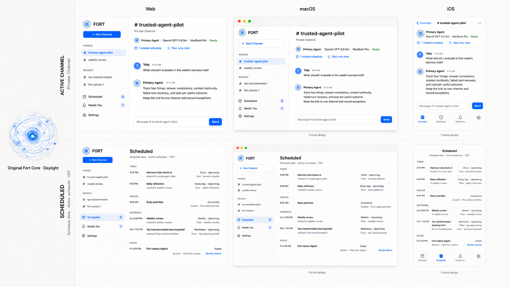
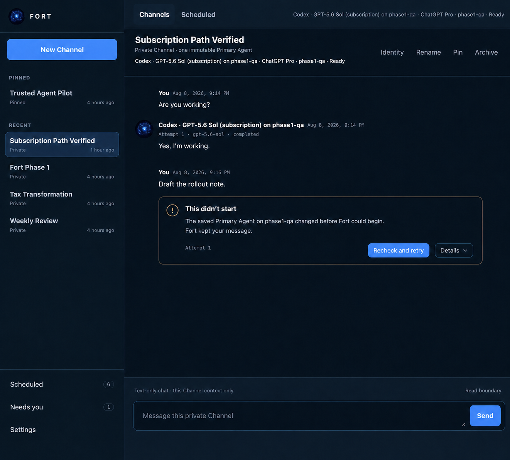
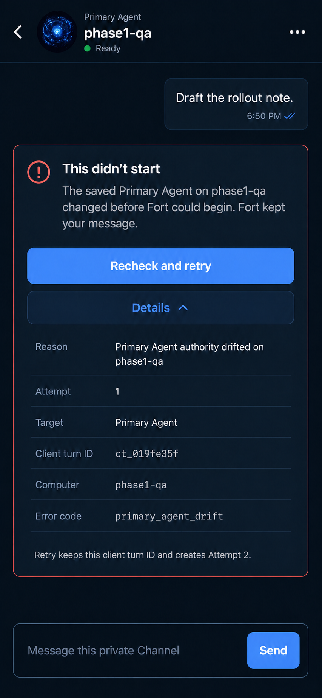
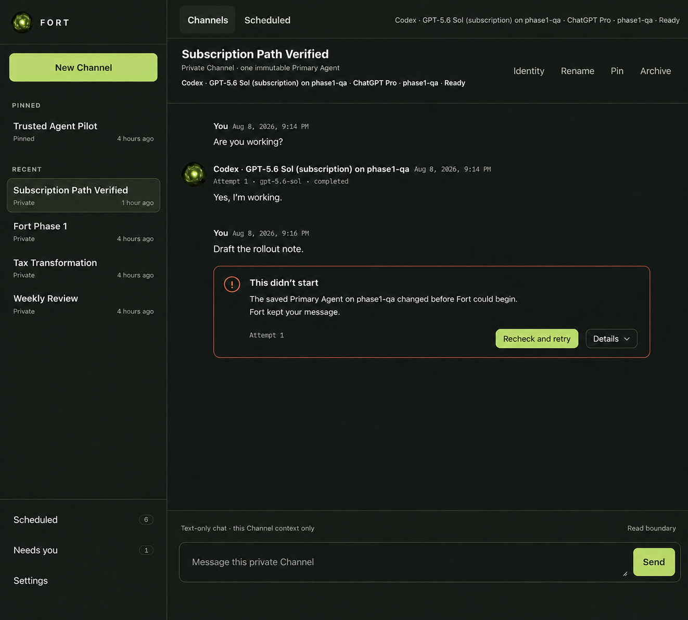
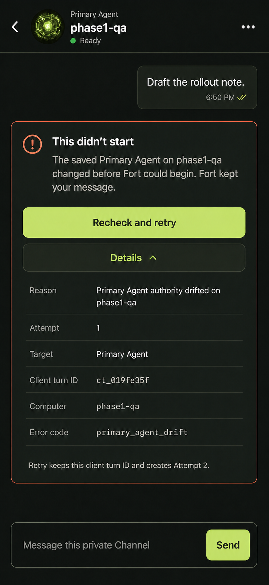
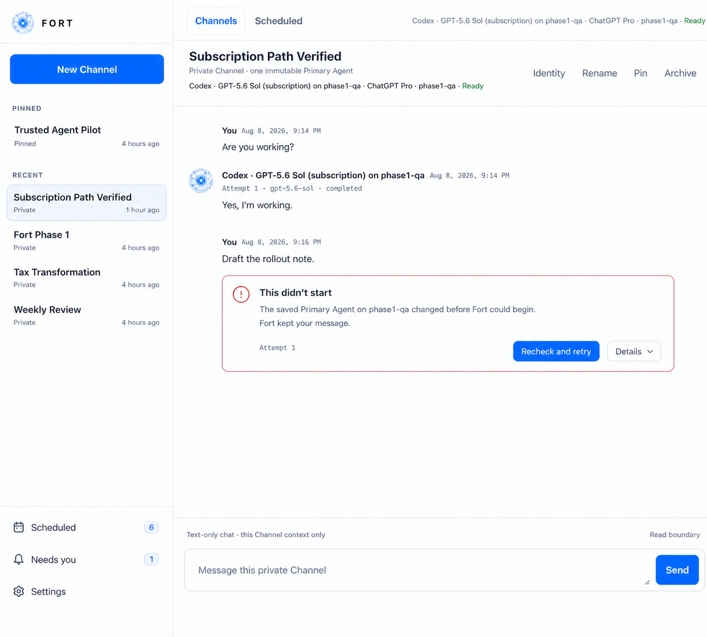
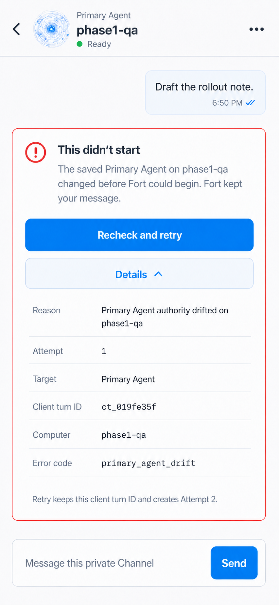

# Spec 044 — Phase 1: Private Primary Channels

**Status:** approved for implementation on 2026-08-08 — live provider use,
`primary` promotion, and the trial remain blocked until the deployment-specific
Codex subscription, executable/schema, and schedule-inventory checks below are
complete
**Date:** 2026-08-08
**Decision owner:** Toby
**Depends on:** Spec 043 direction; Spec 041 durable conversation, immutable
seat, retry, cancellation, and restart contracts; Spec 042 Slice B exact-model
contract
**Shipping surfaces:** local Web, native macOS, and native iPhone/TestFlight

## Decision

Phase 1 is a design-gated, cross-platform implementation of multiple dependable
private Channels, each with exactly one immutable Primary Agent. A Channel is
the durable user-owned context boundary, not a public messaging feature, a
Project, or a provider session. It maps 1:1 to one existing canonical
conversation row: `channel_id == conversation.id`.

Messages, turns, targets, retries, and compiled model context are always scoped
to that Channel ID. Nothing from another Channel enters the prompt unless a
later explicit source-link contract permits it. Two Channels may use the same
Primary Agent while retaining byte-disjoint transcripts and context.
An existing durable schedule may have one explicit related-Channel link for
navigation/provenance; that link never changes its actual execution target.

Fort will continue to own the canonical conversation, exact agent identity,
target lifecycle, readiness, and cross-machine dispatch. A dedicated
ChatGPT-subscription-backed Codex execution adapter will answer each target in
a fresh ephemeral thread. Fort never resumes that thread and supplies no MCP,
dynamic-tool, browser, connected-app, environment, or multi-agent capability.
The adapter uses an empty per-target work directory plus the closed sandbox,
approval, and process-isolation contract below. A provider request for a
command, tool, file read, file change, or other undeclared capability is an
authority violation that fails the target; Fort does not claim that Codex's
read-only sandbox alone makes file inspection impossible.

The default experience contains only:

1. **Channels** — pinned and recent private Channels ordered by newest durable
   activity;
2. **Transcript** — canonical human and attributed agent messages;
3. **Composer** — one input and Send action targeting the Channel's one persisted
   participant;
4. **Scheduled** — every durable schedule definition plus upcoming and recent
   occurrence state;
5. **Needs you** — unresolved latest failed Channel targets that have a real
   recovery action; and
6. **Settings** — Primary Agent identity, text-only eligibility, readiness, and
   explicit Recheck.

Phase 1 does not implement Memory V1, Act, new task records, schedule creation
or mutation, projects, playbooks, or DAG authoring. It preserves and exposes
existing durable schedule execution truthfully through the same typed contract
on Web, macOS, and iPhone. The Phase 1 iPhone archive contains no watchOS app,
complication, or CarPlay scene. Those constrained surfaces require a separately
approved Primary contract and transport before they may return.

## Authorization gate

This document is implementation-ready, but it is not self-authorizing.
Production work starts only after both conditions are satisfied. Toby has now:

- approved all three recorded visual treatments as local Web presentation
  themes for the one shared Channel/Scheduled behavior, with Quiet Intelligence
  as the default; and
- explicitly approved this implementation contract, including the
  ChatGPT-subscription-backed Codex execution lane and its stated isolation
  limits; and
- on 2026-08-09 explicitly authorized shipping the approved Phase 1 experience
  to GitHub, the signed Mac app on this machine, and iPhone/TestFlight. That
  authorization expands production UI scope to `ui/apple/**`; it does not
  silently accept an unnamed schedule inventory digest or waive provider,
  signing, processing, or live acceptance evidence; and
- on 2026-08-09 explicitly authorized removing presentation and compiled client
  functionality outside this Phase 1 allowlist across Web and Apple channels.
  Durable legacy data and server-side administrative contracts remain intact.

If the selected mockup changes navigation, identity disclosure, status,
recovery, or Settings behavior, update this spec before writing production UI
code. The purpose of this gate is to reject the experience cheaply.

## Why a UI-only simplification is unsafe

The current shared-chat path invokes the ordinary tool-capable runtime:

- Claude runs with its normal tool surface;
- Codex runs with `--sandbox workspace-write`;
- Hermes runs with `--accept-hooks --yolo`; and
- OpenClaw invokes its configured main agent.

A `Chat is read-only` label would therefore be false if the existing dispatch
path were reused unchanged. Phase 1 adds a typed authority contract that every
hop must enforce before a process starts.

## Initial provider decision

Phase 1 makes **a dedicated ChatGPT-subscription-backed Codex execution adapter
the only eligible Primary Agent provider**. It uses app-server only for
no-turn account/model/schema readiness and a separately closed `codex exec`
contract for generation. This is an intentional experiment boundary, not a
permanent provider preference and not the ordinary tool-capable Codex runtime.

The adapter starts the exact version-gated Codex executable as `codex
app-server --stdio`, initializes the accepted experimental schema, sends
`initialized`, and calls:

```text
account/read {"refreshToken":false}
model/list {"includeHidden":true}
```

`account/read` must return `account.type:"chatgpt"` and a nonempty, closed
`account.planType`; every other, absent, malformed, or unknown account shape is
ineligible. Fort persists and shows only the normalized account type
and plan, never email, tokens, or another account identifier. The exact
requested model must appear in the complete paginated model catalog.
Readiness creates no thread and performs no generation. It proves current
authentication and catalog advertisement, not that a later generation is
entitled or available.

Each Fort target attempt starts one new non-interactive Codex process and one
fresh ephemeral thread. The adapter never invokes `resume`, `fork`, `review`,
or an interactive session and never reuses a thread ID, including for Retry.
It passes an argv vector directly, never through a shell, with the following
closed semantics (line wrapping is illustrative):

```text
codex exec <exact Fort-compiled participant prompt>
  --json
  --sandbox read-only
  --skip-git-repo-check
  --ephemeral
  --ignore-user-config
  --ignore-rules
  --strict-config
  -C <fresh dedicated empty target directory>
  --model <exact requested model>
  -c approval_policy="never"
  -c developer_instructions=<exact versioned policy text>
  -c model_reasoning_effort=<exact approved effort>
  -c web_search="disabled"
  -c tools.update_plan.enabled=false
  -c tools.experimental_request_user_input.enabled=false
  -c skills.include_instructions=false
  -c skills.bundled.enabled=false
  -c include_apps_instructions=false
  -c include_collaboration_mode_instructions=false
  -c include_environment_context=false
  -c include_permissions_instructions=false
  --disable shell_tool
  --disable unified_exec
  --disable apps
  --disable browser_use
  --disable computer_use
  --disable image_generation
  --disable in_app_browser
  --disable multi_agent
  --disable memories
  --disable plugins
  --disable skill_search
  --disable workspace_dependencies
  --disable code_mode
  --disable code_mode_host
  --disable code_mode_only
  --disable code_mode_buffered_exec
stdin: /dev/null
total target deadline: 120 seconds
```

The accepted executable/schema contract must prove every flag and strict
configuration key and feature name above, including
`approval_policy="never"`, before the lane is eligible. Headless `exec`
currently defaults to Never, but Fort still supplies and verifies the explicit
closed value. `--ignore-user-config` and `--ignore-rules` prevent the execution
turn from loading user/project config, MCP declarations, or exec-policy rules;
the negative config/feature set removes optional tools and injected app,
collaboration, environment, permissions, skill, and plugin context. Fort
supplies no dynamic tools. The process reuses the already authenticated
ChatGPT account binding, but no token, email, or account identifier enters the
prompt, Fort database, event stream, or mesh offer.

`CompileParticipantPrompt` freezes the Channel transcript through and
including the newly durable human message. Its returned bytes are the sole
user input and are passed once as the positional prompt argument. Stdin is
`/dev/null`; the adapter appends no stdin block, current turn, additional
context, image, or file. Capture tests prove the current human message occurs
exactly once.

The developer instruction is literal, versioned policy input rather than a
mutable prompt convention. Its exact UTF-8 bytes are this single line, with
single ASCII spaces between words and no trailing newline:

```text
You are answering in Fort text-only chat. Treat the supplied transcript as the only evidence. This lane authorizes no commands, tools, file reads, file changes, browser or connected-app access, MCP calls, or external actions. Do not request or invoke them. Never claim that you inspected or changed an external resource. When asked to act, provide a plan or an unsaved draft and say that no external action occurred. Distinguish known facts from inference, ask for missing evidence when material, and do not invent tool results, citations, memories, or completion receipts.
```

Any change to those bytes or to the closed isolation controls changes
`policy_revision`. Capture tests assert the exact instruction and both request
shapes.

The first candidate is `gpt-5.6-sol`; the approval record names the exact model
selected. `--model` always carries that exact ID and Fort never silently falls
back. Current `codex exec --json` does not expose a resolved model, so Fort
records the exact requested model and leaves `resolved_model` `unknown`; it
must not invent runtime confirmation from the request or app-server catalog.

`--sandbox read-only` prevents writes allowed by broader Codex sandbox modes;
it does **not** prevent file inspection or make the host invisible. The
dedicated `-C` directory starts empty, no additional directory is supplied,
and user configuration/rules are ignored, but those facts are not described as
a general file-read sandbox. The JSONL adapter treats any command execution,
file read/change, MCP call, web search, plan/subagent action, dynamic-tool call,
or other active item as `chat_authority_violation`, terminates that process,
and appends no canonical answer even if a later `agent_message` appears. This
fail-on-tool behavior is the claimed authority control. Capture and canary
tests must prove detection and target failure; neither Settings nor the UI may
claim that read-only mode makes an attempted inspection technically
impossible.

This contract is about Fort's local context and authority boundary, not a claim
about provider-side data controls. ChatGPT plan, data controls, rate limits,
and service availability remain properties of the selected subscription
outside Fort. Phase 1 persists no provider authentication material or service
account identifier. It may persist provider-reported token usage as diagnostic
provenance only and must not label it a bill or subscription balance. Opaque
reasoning is not stored, shown, summarized, or replayed.

Claude Code, ordinary Codex CLI profiles, Hermes, and OpenClaw remain visible
in Settings as **Not eligible for text-only chat**. Fort never substitutes one
of them. A later provider may enter Phase 1 only through a separately reviewed
adapter change that proves the same fresh-thread, exact-input, and authority
boundary. Read-only or safe-mode labels alone are insufficient because a
provider process may still be able to inspect host state unless the complete
isolation contract is enforced and tested.

## Scope

### Included

- one persisted exact Primary Agent selection;
- private Primary Channels with exactly one immutable participant;
- Channel rename, pin, archive/reopen, and newest-first private navigation;
- a read-only Scheduled destination backed by all durable definitions and
  occurrences, not only today's projection;
- a quiet local-Web shell at `/` plus native macOS and iPhone containers;
- a narrow text-only runtime authority carried end to end;
- fail-closed readiness, model, machine, policy, and adapter validation;
- restart/reload, same-seat retry, cancellation, and SSE reconstruction;
- truthful Needs-you projection for failed primary targets;
- the new shell in full `fort serve`, preserving scheduler ownership;
- local and two-machine contract acceptance; and
- three coordinated presentation themes across Web, macOS, and iPhone with one
  shared behavior contract.

### Explicitly deferred

- cross-conversation memory, user profile, summaries, context checkpoints,
  compaction, and transcript search;
- Act, approvals, receipts, files, connectors, email, browser, and other
  external mutations;
- new task records; schedule create/edit/pause/resume/delete/Run-now;
  Channel-bound scheduled prompts; Today/Week calendar boards; Projects;
  playbook/route/DAG/planner/solver authoring; assignments, metrics, and raw run
  activity;
- multi-agent chats, participant management, Everyone, and Ask another agent;
- cross-Channel full-text search, folders, and Channel deletion in the new
  shell;
- provider-native session continuation;
- any watchOS, complication, or CarPlay product, and public gateway-Web
  presentation;
- deletion of durable legacy data or server-side administrative contracts; and
- further Spec 039 planner, solver, or setup expansion.

The existing 65,536-byte frozen-context limit remains unchanged and visible.
Crossing it fails before persistence or dispatch with
`conversation_context_limit`. Phase 2 must replace this cliff with the approved
continuity design; Phase 1 must not hide it.

## Experience contract

### First run

The root page shows a calm explanation and one **Choose Primary Agent** action.
It opens Settings. The composer is not shown as usable until an eligible exact
seat has been selected.

Settings groups options by computer and shows:

- profile and provider;
- exact requested/resolved model when available;
- computer;
- ChatGPT subscription account type and plan from the current
  `account/read` result;
- adapter, Codex executable version/revision, and accepted app-server schema
  revision;
- text-only policy and adapter revision;
- ephemeral-thread, empty-workdir, read-only sandbox, never-approve,
  no-dynamic-tools/MCP, command-denial, and file-read-denial isolation
  provenance;
- Ready, unavailable, setup-required, or ineligible text; and
- Recheck.

Recheck runs the existing bounded no-turn probes. It never installs software,
authenticates, changes models, dispatches a turn, or reroutes a seat.

### Normal Channel

Creating a Channel asks only for its name. Fort snapshots the configured Primary
Agent into exactly one participant. The header shows a compact identity such
as:

```text
Primary Agent · Codex GPT-5.6 Sol · ChatGPT Pro · MacBook Pro · Ready
```

An identity disclosure shows the full stored seat, text-only policy, adapter,
ChatGPT account type/plan, Codex executable/schema revisions, and isolation
provenance. A compact **Text-only chat** label explains that Fort supplies only
this Channel context, supplies no MCP or dynamic tools, and fails any command,
tool, or file-access attempt. It does not claim that read-only sandboxing alone
makes inspection impossible.

The composer contains one text input and Send. It has no provider, model,
computer, seat, participant, target, or Everyone control.

Changing the Primary Agent in Settings affects only Channels created afterward.
It never updates, retargets, relabels, or silently migrates an existing Channel.

### State and recovery

The transcript and Channel list use only durable/event-derived state:

- **Queued** — the target is durable but the provider has not produced current
  activity;
- **Working** — current durable provider activity exists;
- **Answered** — the attributed terminal answer is durable;
- **Failed** — the durable target contains a bounded failure;
- **Canceled** — cancellation is durable.

The Fort orb may animate only while a target is truthfully Working. Status is
always shown in text and never by color or motion alone.

A current Queued or Working target offers Cancel. A current Failed target
offers Retry or Recheck and retry according to its error code. Retry targets
the same persisted participant, model, computer, text-only policy, and frozen
context. Fort never silently reroutes.

Turn status uses progressive disclosure beside the initiating human message;
there is no permanent transcript-wide **Durable turn status** section:

- **Answered** has no separate status card because the attributed durable
  answer is already the completion evidence.
- the latest **Queued** attempt shows a compact **Starting Primary Agent…** row;
  the latest **Working** attempt shows **Primary Agent is working** and Cancel;
- the latest **Failed** attempt remains as a recovery card. A failure that did
  not begin says **This didn’t start**; `daemon_interrupted` says **Answer
  interrupted**. The card keeps Retry or Recheck and retry visible and puts
  technical evidence behind a collapsed **Details** disclosure;
- **Canceled** becomes the compact transcript note **Canceled by you** with its
  durable time and a collapsed Details disclosure; and
- a newer attempt replaces the older attempt's status/recovery presentation.
  Historical attempts remain durable but do not expose stale recovery actions.

Expanded Details shows the bounded reason, attempt number, target label, client
turn ID, computer, and exact error code. Raw target IDs and client turn IDs are
not visible while Details is collapsed. Recovery copy states that retry keeps
the same client turn ID and creates the next attempt. The disclosure and
recovery controls remain keyboard accessible, use the same local theme tokens,
and preserve the same behavior in all three Web themes.

### Needs you

Needs you is a projection, not a new task system. It includes only the latest
unresolved Failed target for an open Primary Channel when that target has a
current recovery action.

- starting a retry removes the failed item while the latest attempt is Queued
  or Working;
- a later failure creates the new latest item;
- an Answered attempt resolves it;
- Canceled targets do not appear; and
- historical failed attempts with a newer attempt do not appear.

Each item deep-links to the exact conversation and target. The badge/drawer is
absent when the projection is empty.

### Scheduled

Scheduled is a top-level chronological destination, not a Today board or a
permanent dashboard rail. It lists every persisted definition—including
paused and non-today schedules—and its latest/upcoming occurrence evidence.
Each row shows:

- durable schedule ID and title;
- **Active** or **Paused** definition state;
- Once or recurring cadence in human language plus the stored IANA timezone;
- exact next and last fire instants;
- truthful target kind and identity, initially the existing `flow_id`;
- latest occurrence state: **Upcoming, Fired, Running, Completed, Failed,** or
  **Canceled**;
- occurrence error and linked run/observed execution identity when available;
- scheduler ownership state: **Active, Inactive,** or **Unknown**; and
- projection freshness time.

Unlinked flow schedules are labelled **System schedules**. An explicitly
linked schedule may show Related Channel and Open Channel, while its actual
flow target remains visible. Fort never guesses a Channel binding or implies
that a flow result appeared in a Channel. Upcoming items offer View schedule;
Fired/Running offer Open run; Completed offers View result; Failed offers
Review failure. There is no Retry because silently replaying an already claimed
occurrence would violate the once-only contract.

All Scheduled operations in Phase 1 are reads. Creating, editing, enabling,
pausing, resuming, deleting, or manually firing a schedule requires a later
approved contract.

### Navigation and responsive behavior

- `/` is the new private-Channels and Scheduled shell.
- while `FORT_PRIMARY_CHANNELS` is `preview` or `primary`, `/shared`, `/legacy`,
  and their presentation-only APIs are not mounted;
- setting `FORT_PRIMARY_CHANNELS=off` and restarting is the only supported
  same-binary presentation rollback. In that mode `/` retains the current
  shared surface and the existing rollback/admin routes may be mounted.

Desktop web uses a Channels rail with **New Channel**, pinned/recent Channels,
Scheduled, Needs you, and Settings. Selecting Scheduled replaces the transcript
with its chronological list; detail opens in a drawer. Needs you and Settings
remain temporary drawers, not permanent dashboard columns. Below approximately
860px, the Channels rail becomes a keyboard-accessible sheet.

Acceptance viewports are 1280×720 and 390×844, with a compact-phone check at
375×667 with the keyboard present. Interactive targets are at least 44 CSS
pixels. The page must have visible focus, logical tab order, no horizontal
overflow, reduced-motion behavior, and SSE reconnect/rebuild without duplicate
messages.

## Cross-platform design gate

The three mockup treatments are approved presentation themes for one coherent
experience. They share the same product hierarchy, behavior, API calls,
identity, durable state, recovery actions, accessibility contract, and
responsive breakpoints; no treatment may fork product semantics. Web users may
select any of the three locally. **Quiet Intelligence** is the default. The
choice is a local UI preference only: it is not synced through Fort, persisted
as Channel or target identity, sent to the provider, exposed as an orchestration
setting, or allowed to change another client.

Web stores the choice only in browser-local storage under
`fort.primary.theme.v1`, with closed values `quiet-intelligence`,
`private-channels`, and `native-daylight`. Missing, unavailable, or invalid
values select `quiet-intelligence`. There is no server endpoint, database row,
cookie, event, or cross-device synchronization for this preference.

Each treatment must show that same experience across:

1. Web desktop at approximately 1440×900;
2. native macOS at approximately 1240×800; and
3. native iPhone at approximately 393×852 without a device bezel.

All three surfaces use the same sample Channel, exact Primary Agent, message
order, schedule IDs/order, and durable states so the comparison is about
presentation. Each treatment shows both the active Channel state and the
Scheduled destination. The visual language may vary, but every option must
show:

- unmistakable private Channels navigation with pinned and recent Channels;
- one transcript and composer;
- a distinct Scheduled destination showing upcoming, recent, paused, and
  failed durable state;
- full identity available without dominating the conversation;
- the text-only boundary;
- a small Needs-you entry point;
- Settings with readiness and Recheck; and
- truthful Queued, Working, Answered, Failed, and recovery states.

The mockups must not show memory, Act, projects, Today/Week boards, schedule
authoring, playbooks, DAGs, participant chips, metrics, or a public user
directory. The macOS and iOS mockups are now implementation references. They
claim parity only after FortKit consumes the canonical Primary Channel and
schedule-read contracts and the platform acceptance below passes.

The Fort mark retains the existing orbital intelligence-core aesthetic: dense
concentric rings, fine technical arcs, luminous nodes, and a bright central
core. A treatment may recolor or rematerialize that orb to match its surface,
but it must not replace it with new geometry, flatten it into a different
symbol, or make logo color carry runtime state. Alternative presentations may
use the deep-navy/electric-blue, graphite/olive/lime, or daylight/cobalt
language while keeping the product structure identical.

### Latest mockup checkpoint — 2026-08-08

These are the current Phase 1 visual references. They intentionally preserve
one Channel/Scheduled UX and the original Fort orbital-core aesthetic. Only the
surface palette/material and matching orb colors vary. macOS and iOS are now
authorized release targets subject to the same evidence and acceptance gates.

#### Quiet Intelligence — original blue core



#### Private Channels — original lime core



#### Native Daylight — original daylight core



All three treatments are approved for Web Phase 1 as user-selectable local
presentation themes. Quiet Intelligence is the default. The shared product
hierarchy, controls, state, and API behavior may not fork by treatment. Saving
or changing the local theme preference is not a durable Fort domain event and
does not alter a Channel, schedule, target, or provider request.

### Progressive turn-status checkpoint — 2026-08-09

These approved Web references replace the always-visible durable-status stack
with the progressive-disclosure behavior in State and recovery. Desktop shows
the default collapsed recovery state; mobile shows the same state with Details
expanded. The palettes and orb material vary, while copy, hierarchy, durable
semantics, recovery actions, and responsive behavior remain identical.

#### Quiet Intelligence





#### Private Channels





#### Native Daylight





## Persistence contract

Phase 1 uses additive tables and leaves every existing conversation row
untouched.

### `primary_agent_setting`

```sql
CREATE TABLE IF NOT EXISTS primary_agent_setting (
  singleton INTEGER PRIMARY KEY CHECK(singleton=1),
  option_id TEXT NOT NULL,
  seat_id TEXT NOT NULL,
  profile TEXT NOT NULL,
  agent TEXT NOT NULL,
  model TEXT NOT NULL,
  machine TEXT NOT NULL,
  display_name TEXT NOT NULL,
  authority TEXT NOT NULL CHECK(authority='chat_subscription_isolated_v1'),
  policy_id TEXT NOT NULL CHECK(policy_id='codex-subscription-chat-v1'),
  policy_revision TEXT NOT NULL,
  runtime_contract TEXT NOT NULL CHECK(runtime_contract='codex_subscription_exec_v1'),
  adapter_id TEXT NOT NULL,
  adapter_revision TEXT NOT NULL,
  reasoning_effort TEXT NOT NULL,
  reasoning_context TEXT NOT NULL CHECK(reasoning_context='current_turn'),
  request_timeout_millis INTEGER NOT NULL,
  developer_instruction_revision TEXT NOT NULL,
  account_type TEXT NOT NULL CHECK(account_type='chatgpt'),
  account_plan TEXT NOT NULL CHECK(length(trim(account_plan))>0),
  codex_version TEXT NOT NULL,
  codex_executable_revision TEXT NOT NULL,
  codex_schema_revision TEXT NOT NULL,
  thread_mode TEXT NOT NULL CHECK(thread_mode='ephemeral'),
  sandbox_mode TEXT NOT NULL CHECK(sandbox_mode='readOnly'),
  approval_policy TEXT NOT NULL CHECK(approval_policy='never'),
  workdir_mode TEXT NOT NULL CHECK(workdir_mode='empty_per_target'),
  dynamic_tools_mode TEXT NOT NULL CHECK(dynamic_tools_mode='none'),
  mcp_mode TEXT NOT NULL CHECK(mcp_mode='none'),
  command_policy TEXT NOT NULL CHECK(command_policy='deny_and_fail'),
  file_read_policy TEXT NOT NULL CHECK(file_read_policy='deny_and_fail'),
  isolation_revision TEXT NOT NULL,
  updated_at TEXT NOT NULL
);
```

The row is an atomic upsert of a currently ready text-only option. Readiness
and failure reason are current projections and are not persisted as identity.
`option_id` is a `primary-option:v1` digest over the exact seat, normalized
ChatGPT account type/plan, Codex executable/schema identity, adapter, and
authority policy. It does not change the meaning of legacy `seat:v1`. Email,
ChatGPT tokens, local authentication paths, and provider account identifiers
never cross the mesh or enter SQLite.

### `primary_channel`

```sql
CREATE TABLE IF NOT EXISTS primary_channel (
  conversation_id TEXT PRIMARY KEY,
  participant_id TEXT NOT NULL UNIQUE,
  authority TEXT NOT NULL CHECK(authority='chat_subscription_isolated_v1'),
  policy_id TEXT NOT NULL CHECK(policy_id='codex-subscription-chat-v1'),
  policy_revision TEXT NOT NULL,
  adapter_id TEXT NOT NULL,
  adapter_revision TEXT NOT NULL,
  runtime_contract TEXT NOT NULL CHECK(runtime_contract='codex_subscription_exec_v1'),
  reasoning_effort TEXT NOT NULL,
  reasoning_context TEXT NOT NULL CHECK(reasoning_context='current_turn'),
  request_timeout_millis INTEGER NOT NULL,
  developer_instruction_revision TEXT NOT NULL,
  account_type TEXT NOT NULL CHECK(account_type='chatgpt'),
  account_plan TEXT NOT NULL CHECK(length(trim(account_plan))>0),
  codex_version TEXT NOT NULL,
  codex_executable_revision TEXT NOT NULL,
  codex_schema_revision TEXT NOT NULL,
  thread_mode TEXT NOT NULL CHECK(thread_mode='ephemeral'),
  sandbox_mode TEXT NOT NULL CHECK(sandbox_mode='readOnly'),
  approval_policy TEXT NOT NULL CHECK(approval_policy='never'),
  workdir_mode TEXT NOT NULL CHECK(workdir_mode='empty_per_target'),
  dynamic_tools_mode TEXT NOT NULL CHECK(dynamic_tools_mode='none'),
  mcp_mode TEXT NOT NULL CHECK(mcp_mode='none'),
  command_policy TEXT NOT NULL CHECK(command_policy='deny_and_fail'),
  file_read_policy TEXT NOT NULL CHECK(file_read_policy='deny_and_fail'),
  isolation_revision TEXT NOT NULL,
  created_at TEXT NOT NULL,
  FOREIGN KEY(conversation_id) REFERENCES conversation(id) ON DELETE CASCADE,
  FOREIGN KEY(participant_id) REFERENCES conversation_participant(id)
);
```

The existing participant remains the canonical profile, provider/model, and
computer snapshot. The marker adds the stable approved text-only policy and
nonsecret ChatGPT plan, Codex contract, and isolation snapshot. It is immutable
after Channel creation: application code and database triggers reject update
or delete.

Creating a Primary Channel atomically inserts the conversation, exactly one
participant copied from the setting, and the marker. Existing conversations
have no marker and are legacy shared conversations; there is no backfill.

Participant add/remove operations reject a marked Primary Channel. Rename,
archive, and reopen remain allowed. The Phase 1 shell does not expose Delete.

Pin state is intentionally separate from immutable Channel identity:

```sql
CREATE TABLE IF NOT EXISTS primary_channel_pin (
  conversation_id TEXT PRIMARY KEY,
  pinned_at TEXT NOT NULL,
  FOREIGN KEY(conversation_id) REFERENCES primary_channel(conversation_id)
    ON DELETE CASCADE
);
```

Pinning is an idempotent upsert; unpinning deletes only this projection row.
Lists order pinned Channels by `pinned_at DESC`, then unpinned Channels by
durable conversation activity descending with stable ID tie-breaking.

An optional explicit display/provenance link associates an existing durable
schedule with a Channel without changing what the schedule executes:

```sql
CREATE TABLE IF NOT EXISTS schedule_channel_link (
  schedule_id TEXT PRIMARY KEY,
  conversation_id TEXT NOT NULL,
  created_at TEXT NOT NULL,
  FOREIGN KEY(schedule_id) REFERENCES schedule(id) ON DELETE CASCADE,
  FOREIGN KEY(conversation_id) REFERENCES primary_channel(conversation_id)
    ON DELETE CASCADE
);
```

Phase 1 does not expose link creation or mutation. When the row exists, the UI
may show **Related Channel** and Open Channel; it must still display the
truthful flow target separately. When absent, the schedule is **System**. Fort
never derives this link from matching names, prompts, flow IDs, or model prose.

### Per-attempt authority provenance

Add these columns to `conversation_target` through the existing idempotent
column migration pattern:

```text
authority, policy_id, policy_revision, runtime_contract,
selected_adapter_id, selected_adapter_revision,
selected_codex_version, selected_codex_executable_revision,
selected_codex_schema_revision,
requested_model, reasoning_effort, reasoning_context, request_timeout_millis,
developer_instruction_revision,
account_type, account_plan, thread_mode, sandbox_mode, approval_policy,
workdir_mode, dynamic_tools_mode, mcp_mode, command_policy, file_read_policy,
isolation_revision,
observed_adapter_id, observed_adapter_revision,
observed_codex_version, observed_codex_executable_revision,
observed_codex_schema_revision,
resolved_model, provider_thread_id, provider_terminal_status,
usage_source, input_tokens, cached_input_tokens,
output_tokens, reasoning_tokens
```

The policy, request-policy, ChatGPT account/plan, Codex contract, isolation,
and selected-adapter fields are resolved synchronously and populated before
target commit and `202 Accepted`. Async dispatch must match that exact
selection or fail drift before starting `codex exec`. Observed adapter, Codex
identity, ephemeral thread ID, terminal status, and usage fields are
written only from a typed response-metadata receipt. They commit atomically
with the terminal answer or failure so an Answered target cannot lack its
claimed provenance. The provider thread ID is evidence only and is never fed
to a later attempt. Current JSONL exposes no turn ID or resolved model; those
facts remain absent/`unknown` rather than inferred. Unavailable values remain
empty/`unknown`. The UI derives the authority label of each answer from its own
target, never from the
conversation marker alone.

The policy revision is stable Channel behavior. Selected and observed adapter,
Codex executable, schema, and isolation revisions describe one execution
attempt. Retry may change only `selected_adapter_revision`, and only to a newly
approved compatible revision with the exact same adapter ID, Channel policy,
seat, ChatGPT account/plan, Codex version/executable/schema revisions, runtime
contract, and isolation/request-policy snapshot. It creates a new target and
fresh ephemeral thread and records the new adapter selection. Any other changed
field fails closed and requires a future explicit migration or a new Channel.

`codex_executable_revision` and `codex_schema_revision` are exact lowercase
64-character SHA-256 values validated at every store, API, mesh, and runtime
boundary. They identify the held executable bytes and accepted generated
contract/schema bundle respectively; a version string alone is not authority.
The accepted v1 schema revision is SHA-256 over these exact UTF-8 bytes:

```text
codex-schema-contract:v1
normal:be9de4ce887d8338794dbd330202fb5bdbd43316cc73b721efacf4542c8607b9:285
experimental:2b6fb0da3b974ed25389d021f274900837c3ae5d406ba85be8cde45a21d0214f:361
```

including the final newline. Its value is
`c59b4927dfaaaddcd78fd581bbe4c18649bb9adc42453a23b719b9df403156f2`.
`runtime_contract` is the immutable closed value
`codex_subscription_exec_v1` and prevents a target from drifting to app-server
turns, native Codex defaults, or another transport.

### Database enforcement against old code

Migrations add SQLite triggers that reject:

- insert of a primary marker unless its participant belongs to the same
  conversation and that conversation has exactly one active participant;
- update or delete of a primary marker;
- insert, update, or delete of a participant in a marked Primary Channel;
- deletion of a marked primary conversation; and
- insertion of a target for a marked Primary Channel unless its authority,
  policy id, policy revision, exact request-policy fields, ChatGPT account/plan,
  Codex contract, and isolation fields exactly match the marker, and its
  selected-adapter identity is nonempty.

These triggers are part of the invariant, not merely UI validation. An older
binary omits the new target authority fields and therefore cannot append a
tool-capable turn to a marked Channel. Existing legacy targets remain policy
`unknown`; they are never relabelled text-only.

Target authority, policy, request-policy, account/plan, Codex contract,
isolation, and selected-adapter fields are immutable after insertion. Observed
metadata may make one validated transition from empty to the terminal receipt
in the same transaction as Answered/Failed/Canceled; it cannot be rewritten
later.

Rollback does not deploy an older binary against a database containing Primary
Channels. Use the accepted new binary's full `fort serve` mode, or restore a
coordinated pre-Phase-1 database snapshot with the older binary.

## Text-only capability and policy

Reuse the bounded capability inventory instead of creating a second readiness
system.

Add:

- provider-agent key `codex-subscription`;
- exact profile `codex-subscription:gpt-5.6-sol` using
  `SelectionModel{ModelID: "gpt-5.6-sol"}`; provider identity remains the
  separate `codex-subscription` agent key and is never prefixed onto
  `RunSpec.Model`;
- logical capability `model.chat.text-only`;
- adapter `model.chat.text-only.codex-subscription`;
- policy `codex-subscription-chat-v1`;
- runtime contract `codex_subscription_exec_v1`; and
- pinned Codex executable and generated app-server/config schema revisions.

This is a new authority profile, not the ordinary Codex CLI seat. Its closed
predicates hold the exact executable bytes, reproduce the accepted schema
bundle, verify every required `codex exec` flag and strict configuration key,
and run the no-turn app-server handshake. `account/read` must report
`type:"chatgpt"` and an explicit schema-known `planType`; the complete
paginated `model/list` must contain the exact requested model. Every non-ChatGPT
account type is ineligible. The account email and saved ChatGPT auth
material are process-private and forbidden from normalized readiness,
capability offers, events, logs, and persistence.

The probe starts no Codex turn, consumes no generated tokens, changes no
configuration, and does not authenticate the user. A normally ready Codex CLI
profile is not automatically text-only eligible. The accepted executable and
schema revisions are lowercase SHA-256 values; any changed bytes, flag/config
shape, account type/plan, model advertisement, or isolation canary make the
option unavailable until an explicit Recheck succeeds against a newly approved
catalog revision.

Primary Agent options combine current profile/model/computer readiness,
ChatGPT account type/plan, Codex executable/schema identity, and a ready
policy-certified adapter. Selection snapshots those facts and the currently
observed adapter. Channel creation snapshots the policy and authority facts.
Turn creation synchronously revalidates the same profile, model, computer,
account/plan, executable/schema, policy, runtime contract, and adapter and
records that exact selection on the target before returning `202`. Dispatch
revalidates it once more. Missing or changed identity fails closed before
`codex exec`, with no reroute or fallback.

Remote computers publish the same information through a new closed,
secret-free capability wire type:

```go
type TextOnlyOptionOffer struct {
    OfferVersion             int
    MachineID                string
    SeatID                   string
    AgentKey                 string
    ProfileID                string
    RequestedModel           string
    ResolvedModel            string
    AccountType              string
    AccountPlan              string
    PolicyID                 string
    PolicyRevision           string
    RuntimeContract          string
    ReasoningEffort          string
    ReasoningContext         string
    RequestTimeoutMillis     int
    DeveloperInstructionRev  string
    AdapterID                string
    AdapterRevision          string
    CodexVersion             string
    CodexExecutableRevision  string
    CodexSchemaRevision      string
    ThreadMode               string
    SandboxMode              string
    ApprovalPolicy           string
    WorkdirMode              string
    DynamicToolsMode         string
    MCPMode                  string
    CommandPolicy            string
    FileReadPolicy           string
    IsolationRevision        string
}
```

The node emits this offer only from normalized local policy plus a successful
bounded readiness check. The hub validates closed enums, bounds, lowercase
SHA-256 revisions, exact profile/agent/model/account relationships,
machine/seat identity, policy/runtime/adapter compatibility, and absence of
secret material. It canonicalizes the fields in the order above and computes
`primary-option:v1` as the
versioned digest; a supplied or cached digest is never trusted. Duplicate or
conflicting offers make that machine's text-only options ineligible. ChatGPT
tokens, email, auth paths, and derivations are forbidden from the offer.

The capability protocol and inventory wire schema advance together. A peer
that omits `TextOnlyOptionOffer`, sends an unknown offer version, or cannot
validate its complete contract remains visible through ordinary profile
inventory but is **Not eligible for text-only chat**. The hub never fills
missing account, Codex, isolation, or adapter fields from its own environment
and never hides them inside predicate IDs.

Capability protocol versions must advance because an old peer cannot enforce
the new authority field. An old or unverified node is ineligible; Fort must not
send it a text-only turn and hope it ignores unknown fields safely.

The current `seat:v1` meaning remains unchanged. Text-only identity is the
persisted seat plus the separate policy snapshot; it does not silently alter
legacy seat semantics.

## Runtime contract

Extend `runtime.RunSpec` with a closed, wire-visible request policy rather than
free-form fields:

```go
type AuthorityMode string
type ReasoningEffort string

const AuthorityChatSubscriptionIsolatedV1 AuthorityMode = "chat_subscription_isolated_v1"

type TextOnlyPolicy struct {
    PolicyID                      string
    PolicyRevision                string
    Model                         string
    ReasoningEffort               ReasoningEffort
    ReasoningContext              string // exactly "current_turn"
    RequestTimeoutMillis          int    // exactly 120000 in v1
    DeveloperInstructionRevision string
    AccountType                   string // exactly "chatgpt"
    AccountPlan                   string
    SelectedAdapterID             string
    SelectedAdapterRevision       string
    SelectedCodexVersion          string
    SelectedCodexExecutableRevision string
    SelectedCodexSchemaRevision   string
    ThreadMode                    string // exactly "ephemeral"
    SandboxMode                   string // exactly "readOnly"
    ApprovalPolicy                string // exactly "never"
    WorkdirMode                   string // exactly "empty_per_target"
    DynamicToolsMode              string // exactly "none"
    MCPMode                       string // exactly "none"
    CommandPolicy                 string // exactly "deny_and_fail"
    FileReadPolicy                string // exactly "deny_and_fail"
    IsolationRevision             string
}

type RunSpec struct {
    // existing fields
    Authority              AuthorityMode
    RuntimeContract        string
    TextOnlyPolicy         *TextOnlyPolicy
    ExpectedPolicyRevision string `json:"-"`
}

type ProviderUsage struct {
    InputTokens       int64
    CachedInputTokens int64
    OutputTokens      int64
    ReasoningTokens   int64
}

type ResponseMetadata struct {
    ProviderThreadID        string
    RequestedModel          string
    ResolvedModel           string // "unknown" for current exec JSONL
    SelectedAdapterID       string
    SelectedAdapterRevision string
    SelectedCodexVersion    string
    SelectedCodexExecutableRevision string
    SelectedCodexSchemaRevision string
    ObservedAdapterID       string
    ObservedAdapterRevision string
    ObservedCodexVersion    string
    ObservedCodexExecutableRevision string
    ObservedCodexSchemaRevision string
    TerminalStatus          string
    UsageSource             string
    Usage                   ProviderUsage
}

type RunEvent struct {
    // existing Type, Data, Code fields
    Response *ResponseMetadata
}
```

An empty authority retains the legacy execution contract in full `fort serve`
mode only. Any unknown nonempty authority or mismatched runtime contract fails
before a provider request. `TextOnlyPolicy` is required only for the exact
text-only authority and is forbidden for legacy authority. Hub and node
validate every enum, string identity, fixed value, and numeric bound; the
ChatGPT authentication binding remains process-private on the selected computer
and no token, email, or auth path enters this structure.

A Primary Channel dispatch always supplies `chat_subscription_isolated_v1`,
`codex_subscription_exec_v1`, `codex-subscription-chat-v1`, the complete
`TextOnlyPolicy`, and the expected policy revision. Hub-side preflight validates
the revision and clears only the private expected field. Authority, runtime
contract, and text-only policy cross the cluster/remote wire. The text-only
node branch accepts only that exact authority/contract/profile/adapter/policy
combination; empty, legacy, unknown, wrong-contract, and other-provider
requests start zero work.

The full `fort serve` composition uses a closed local runtime multiplexer:

- exact text-only authority plus the `codex-subscription` agent key can route
  only to `exec/codexsubscription`;
- empty legacy authority can route only to the existing native-provider
  runtime; and
- every cross-combination or unknown value fails before work starts.

The same mux policy protects full-mode node execution. Tests prove that no
text-only request can reach `exec/native` and no legacy/native request can
reach the subscription adapter. The new Primary Channel HTTP/port surface has
no generic execution method and cannot construct an empty-authority request;
existing legacy execution remains separately scoped to its established
admin/node surface.

The subscription adapter parses bounded `codex exec --json` JSONL and buffers
the answer until it has observed exactly one `thread.started`, the exact
pre-turn fail-closed Code Mode diagnostic, one `turn.started`, exactly one
completed `agent_message`, and one `turn.completed`. The pinned executable
emits this inert diagnostic because the separately executable code-mode host is
explicitly disabled:

```text
Code Mode is unavailable because code-mode host is disabled. Code mode will fail closed; enable `features.code_mode_host` and install `codex-code-mode-host`.
```

Fort requires that exact diagnostic as a runtime canary: its absence, a changed
message, a duplicate, or any other pre-turn item fails closed and appends no
answer. This proves the live process did not gain the optional code-mode host;
Fort never stages or invokes that host. `thread.started` supplies the only provider thread ID;
`turn.completed` supplies provider-reported usage. Inert `reasoning` items are
allowed; their contents are discarded and never stored, shown, summarized, or
replayed. Any `command_execution`, `file_change`, `mcp_tool_call`,
`collab_tool_call`, `web_search`, `todo_list`, dynamic-tool, other active, or
unknown item immediately fails the target as
`chat_authority_violation`, terminates the process, and discards buffered text.

Any other `error` item, failed/nonzero process, interrupted, canceled, malformed,
truncated, duplicate, or unknown terminal stream maps to a bounded non-Answered
outcome. Partial text is never appended as the canonical answer. A completed
stream with zero or multiple
agent messages, incoherent thread/usage metadata, or an unknown event fails
closed. Current JSONL exposes neither resolved model nor turn ID; Fort stores
`resolved_model:"unknown"` and does not invent a turn identifier. The typed
`ResponseMetadata` receipt is the only transport for
provider provenance; it is never encoded in free-form `Data`. Hub persistence
validates that receipt and commits it atomically with the terminal answer or
failure. A missing adapter, old protocol, unknown runtime contract,
executable/schema drift, or unvalidated flag/config shape returns
`chat_policy_unavailable` with zero generation turns.

## HTTP and port contract

Add narrow `PrimaryChannelPort` and `ScheduleReadPort` contracts. Ordinary
clients never supply participant IDs, seat arrays, or target arrays.

### Primary Agent

```text
GET /api/settings/primary-agent
```

Returns the persisted selection or `null`, its current state/reason, and all
Primary Agent options. It is read-only and invokes no probe or runtime.

```text
PUT /api/settings/primary-agent
{ "option_id": "primary-option:v1:..." }
```

The server resolves a currently ready text-only option and persists the full
seat, ChatGPT account/plan, Codex executable/schema, runtime, isolation, and
policy snapshot. It returns the stored selection plus current state. Unknown,
unready, drifted, or policy-ineligible choices fail closed. A caller cannot
construct a new combination by sending a seat ID plus independent policy
fields.

```text
DELETE /api/settings/primary-agent
```

Clears the default for future Channels. Existing Channel identity is unchanged.

Reuse `POST /api/conversation-seats/recheck` for an explicit fresh probe, or
add a narrow alias that calls the same bounded port. It never dispatches an
agent turn.

### Channels

```text
GET  /api/channels?state=open|archived|all
POST /api/channels                 { "name": "..." }
GET  /api/channels/{id}
PATCH /api/channels/{id}           { "name": "..." }
PATCH /api/channels/{id}           { "state": "open|archived" }
PATCH /api/channels/{id}           { "pinned": true|false }
POST /api/channels/{id}/turns      { "client_turn_id": "uuid", "text": "..." }
POST /api/channels/{id}/targets/{target_id}/retry
POST /api/channels/{id}/targets/{target_id}/cancel
GET  /api/channels/{id}/events
GET  /api/needs-you
```

`GET /api/channels` defaults to `state=open`; `archived` and `all` are the only
other accepted values. Every result emits `[]`, never `null`, with pinned
Channels first and the remaining Channels newest-first. This is the path for
reopening an archived Channel. `GET /api/channels/{id}` returns the canonical
conversation detail plus the complete `primary_identity` snapshot.

Turn creation resolves the marked Channel's sole participant server-side. A
client cannot select another target. `202 Accepted` means the prompt, frozen
context boundary, target, and run identity are durable; it does not mean the
provider succeeded.

Retry/cancel validate that the nested Channel and target match. Missing or foreign
IDs are `404`; valid IDs in the wrong current state are `409`.

`GET /api/needs-you` returns the projection defined above with non-null arrays.
It must not create, mutate, probe, or dispatch anything.

### Scheduled

```go
type ScheduleReadPort interface {
    List(context.Context, ScheduleFilter) (ScheduleList, error)
    Get(context.Context, string) (ScheduleDetail, error)
    Occurrences(context.Context, string, OccurrencePage) ([]scheduler.Occurrence, error)
}
```

```text
GET /api/schedules?state=active|paused|all
GET /api/schedules/{id}
GET /api/schedules/{id}/occurrences?limit=50&before=<RFC3339>&before_id=<id>
```

The list defaults to `state=all` and returns one read-transaction snapshot as
`{"snapshot_id":"schedule-snapshot:v1:...","observed_at":"...","items":[]}`
with non-null items. Phase 1 deliberately does not paginate this personal
catalog because `next_fire_at` and `updated_at` change while the scheduler is
running and cannot form a stable cross-page cursor. The snapshot has a hard
1,000-definition bound; exceeding it returns `schedule_catalog_limit` without
silently truncating. The snapshot ID is a versioned digest of the normalized
returned rows, not a mutable database counter.

The canonical ordering within that snapshot uses three closed buckets: active
definitions with a next fire first, ordered by `next_fire_at ASC, id ASC`;
active definitions without a next fire second, ordered by `updated_at DESC, id
ASC`; paused definitions third with the same updated-time order. Clients render
the server order and retain `snapshot_id` when comparing cross-surface state.

A list item contains definition ID/title, enabled state, kind, expression plus
human-readable recurrence, stored IANA timezone, exact next/last fire instants,
`target_kind:"flow"`, `target_id:<flow_id>`, optional explicitly linked
Channel ID/name, latest occurrence/error/run ID, scheduler ownership state,
and `observed_at`.

Detail includes the same definition plus exactly two non-null bounded
projections at the same observed time: up to 10 upcoming occurrences ordered
`scheduled_for ASC, id ASC`, and up to 10 recent occurrences ordered
`scheduled_for DESC, id DESC`. The full occurrence endpoint is newest-first,
uses a bounded `1..50` limit, and paginates by the exclusive tuple
`(scheduled_for,before_id)` so equal instants cannot duplicate or skip rows.

All three GETs are pure projections: zero writes, timer registration, probes,
model calls, or dispatches. Missing schedules are `404`; invalid filters or
cursors are `400`. The existing `POST /api/schedules` remains available only
on the legacy/admin surface and is not mounted or linked by the new shell.

Closed error codes added by Phase 1 are:

- `primary_agent_not_configured`;
- `primary_agent_unready`;
- `primary_agent_drift`;
- `chat_policy_unavailable`;
- `chat_authority_violation`;
- `primary_channel_invariant`;
- `provider_result_unknown`;
- `provider_incomplete`;
- `provider_refusal`;
- `provider_failed`;
- `schedule_catalog_limit`;
- `schedule_inventory_unaccepted`; and
- `schedule_inventory_drift`.

A confirmed canceled request uses the existing Canceled target state rather
than an error code.

Retain `seat_unready`, `conversation_context_limit`, and existing bounded
target errors.

## `fort serve` composition

Phase 1 does not add or promote a standalone `fort chat` service. A chat-only
process that deliberately omits scheduler/flow ownership could display
persisted schedules while leaving them inactive, which would be materially
misleading. Reintroducing those dependencies would merely recreate `serve`
under another command.

The accepted full `fort serve` composition therefore owns:

- the existing durable scheduler, flow execution, and at-most-once occurrence
  claim path unchanged;
- the new schedule-read projection and explicit scheduler ownership state;
- the Codex subscription/cluster/remote runtime with the text-only authority
  gate and closed local/node runtime mux;
- bounded capability/readiness and exact remote-seat transport;
- Primary Agent and Primary Channel services; and
- the new narrow Channels/Scheduled shell at `/`.

Legacy mutating schedule, flow, project, and board contracts remain implemented
for off-mode rollback and CLI/internal administration, but their Web pages and
presentation APIs are not mounted in `preview`, `primary`, or the sealed native
relay mux. The HTML shell remains loopback-only. The macOS client may call only
the typed Phase 1 JSON/SSE
APIs over same-host loopback; it may not wrap the HTML shell or use direct LAN.
An iPhone/TestFlight client may call those APIs only through Fort's
authenticated, end-to-end encrypted gateway relay, whose outer endpoint must
use HTTPS. The server accepts the relay path only through an unforgeable
in-process request context set after the Noise session opens a sealed request;
no Host, `RemoteAddr`, header, query value, cookie, or public gateway-Web
request may assert it. Direct LAN clients and forged relay headers remain
forbidden. An `Origin`-bearing relayed mutation is rejected, while native
requests carry no browser Origin. No watchOS app, complication, or CarPlay scene
ships in Phase 1, and none receives this authority.

`FORT_PRIMARY_CHANNELS` is a closed startup mode:

- `off` (default) — `/` retains the current shared surface;
  `/channels-preview`, all `/api/channels*` routes, and the new Primary Agent
  setting/Scheduled-read routes are not mounted and return `404`; no stale
  Phase 1 client can create or dispatch work;
- `preview` — the new shell is mounted at `/`, `/channels-preview` redirects to
  `/`, its narrow Phase 1 APIs are enabled, and legacy presentation routes are
  absent; and
- `primary` — the same closed shell and route set are mounted, with promotion's
  additional readiness and accepted-inventory startup gates. Promotion changes
  operational guarantees, not the visible product surface.

Unknown or empty nondefault values fail startup rather than choosing a mode.
Promotion changes only this same-binary mode; it never changes scheduler
ownership or service command.

Scheduler ownership is **Active** only when the same accepted process has
successfully started the durable scheduler. If ownership is inactive or
unknown, Scheduled says so and never presents future occurrences as assured.

Schedule visibility does not reclassify legacy flow authority. Existing flows
may use broader runtimes than Primary Channel text-only turns; each row must say
`target_kind: flow`, show the exact flow ID and observed run identity, and never
inherit the Channel's text-only badge. Before the Phase 1 trial, every enabled
legacy definition is inventoried. Fort computes a
`schedule-inventory:v1` digest over each enabled schedule's normalized ID,
kind, expression, timezone, flow ID, and the canonical loaded flow-definition
digest. A flow digest has format
`flow-definition:v1:<lowercase-hex-sha256>` and hashes the exact UTF-8 bytes
`flow-definition:v1\n`, followed by canonical `json.Marshal(graph.Flow)` for
the loaded and validated `graph.Flow`, followed by one final `\n`.
Semantically significant slice order is preserved; it is not resorted for the
digest.

Each schedule-inventory canonical row has exactly the JSON keys `id`, `kind`,
`expression`, `timezone`, `flow_id`, and `flow_digest`. Rows are sorted by
`id`; no secrets or observation timestamps appear. The inventory digest format is
`schedule-inventory:v1:<lowercase-hex-sha256>`, where SHA-256 covers the exact
UTF-8 bytes `schedule-inventory:v1\n` followed by the canonical JSON array and
one final newline. The empty-inventory digest is therefore
`schedule-inventory:v1:7d5bf4173fd97e9d036d7acd974925bbc4b2ed0553c0c8e9e9ed210d9cea7b76`,
the digest of `schedule-inventory:v1\n[]\n`.

Preview exposes the current digest and inventory rows for review. Toby records
the exact digest and acceptance time in the approval record, then configures
the same nonsecret value as `FORT_ACCEPTED_SCHEDULE_INVENTORY`. `primary`
startup requires this input and compares it byte-for-byte with the freshly
computed digest before mounting the new shell or Phase 1 APIs. A missing input
fails startup with `schedule_inventory_unaccepted`; a mismatch, missing flow
digest, or later changed definition/flow fails startup with
`schedule_inventory_drift`. Preview may start with either condition but must
show current digest, accepted digest or **Not accepted**, and the closed warning;
it may not describe the trial as active. `off` does not require or evaluate the
accepted digest. Phase 1 provides no disable path, authority upgrade, or other
schedule mutation; any operational change requires separate authorization
outside this spec.

## TDD delivery sequence

Every step begins with a focused failing test, observes the failure, then adds
the minimum code to pass. Keep `go test ./...` green after each slice and run
`-race` for concurrency changes.

1. **Baseline checkpoint** — commit the verified Spec 041/042 work and Spec
   043 direction before any Phase 1 code. Exclude generated Apple artifacts.
2. **Domain and store** — setting round-trip/upsert; atomic Channel,
   participant, and marker creation; marker immutability; pin projection;
   pinned/newest-first filtering; two Channels with the same seat retain
   byte-disjoint context; setting changes leave prior Channel identity
   byte-for-byte unchanged; legacy rows are untouched.
3. **Capability policy** — new Codex subscription profile and predicates;
   ChatGPT account type/plan binding; held executable and generated-schema
   revisions; no-turn app-server account/model probe; strict exec flag/config
   validation; exact option projection; policy drift and old peers fail closed;
   zero generated tokens during readiness.
4. **Provider and transport authority** — closed enum validation; argv/stdin/
   workdir capture proves exact model, one canonical prompt argument, stable
   developer instruction, ephemeral/no-resume behavior, ignored user config and
   rules, read-only sandbox, never approvals, disabled web search, no supplied
   MCP/dynamic tools, and bounded timeout; other providers reject before a
   process starts; cluster/remote and the restricted chat node preserve the
   complete typed request policy and typed response metadata; the private
   expected policy revision never crosses the wire; completed/reasoning,
   failed, canceled, malformed, command, file, MCP, web-search, plan/subagent,
   tool, duplicate-message, and unknown JSONL shapes have focused tests.
5. **Control service** — configure the setting; create one-participant Channel;
   server-selected target; synchronously persist exact selected adapter and
   `RunSpec` policy before `202`; offline/drift causes zero starts; observed
   metadata commits atomically with the terminal state; same-seat retry retains
   identity, context, and authority; latest failure reducer is deterministic.
6. **Schedule read projection** — all active, paused, non-today, upcoming, and
   recent schedules/occurrences; UTC persistence with configured-zone display;
   exact flow target and ownership state; GETs cause zero writes, timer
   registration, probes, runtime calls, or model calls.
7. **HTTP** — exact Channel and Schedule methods, bodies, filters, pagination,
   statuses, codes, nested-ID validation, and non-null arrays; GET and Settings
   operations invoke no runtime.
8. **Web shell** — root contains only the six approved product concepts;
   Channel create/send single-flight and client-turn idempotency; Scheduled
   navigation/detail; reload/SSE rebuild; Needs-you deep link; keyboard, focus,
   reduced-motion, and responsive tests. Preview and primary mount no legacy
   presentation; off mode is the explicit rollback.
9. **Composition** — full `fort serve` owns the proven scheduler and new read
   projection; only text-only authority reaches the Codex subscription runtime;
   full-mode local/node mux has no cross-routing; direct mesh and capabilities
   remain functional; new UI invokes no legacy mutating APIs.
10. **Concurrency and canaries** — race tests, local/remote fake turns, daemon
   restart, remote offline without reroute, exact retry, old-node failure,
   request/metadata capture, typed terminal-shape validation, and live prompts
   that request a command/tool/file action produce an authority violation, no
   canonical answer, and no false completion claim.
11. **Visual/live acceptance** — only after the deployment checks in the
    approval record are complete.

## Expected file boundary

New files are expected in these bounded areas:

```text
specs/044-private-primary-channels-phase-1.md
core/conversation/primary.go
core/conversation/primary_test.go
core/store/primary_channel.go
core/store/primary_channel_test.go
control/primary_channel.go
control/primary_channel_test.go
control/schedule_read.go
control/schedule_read_test.go
ui/primary_channel.go
ui/primary_channel_api_test.go
ui/primary_channel_page.go
ui/primary_channel_page_test.go
ui/schedule_read.go
ui/schedule_read_test.go
exec/codexsubscription/runtime.go
exec/codexsubscription/runtime_test.go
exec/runtime_mux.go
exec/runtime_mux_test.go
```

Focused modifications are permitted in:

- `core/store/store.go`;
- `core/runtime/runtime.go`;
- bounded capability catalog, predicate, version, probe, registry, and gate
  files plus their tests;
- `exec/cluster`, `exec/remote`, and a restricted `exec/node` chat path plus
  their tests; the existing native-provider commands remain unchanged;
- `core/store/schedules.go`, `control/conversations.go`, and existing scheduler
  status wiring only for bounded read projection and Primary Channel
  enforcement; schedule claiming/execution semantics remain unchanged;
- `ui/ports.go` and `ui/server.go`;
- `cmd/fort/main.go`, `wire.go`, `capabilities.go`, `service.go`, and focused
  mesh/service tests; and
- README/governing-spec references only after acceptance.

`ui/apple/FortKit/**`, `ui/apple/iOS/**`, `ui/apple/macOS/**`, the Apple project
and release configuration, and focused native tests are authorized by Toby's
2026-08-09 all-channel shipment instruction. The implementation must use the
typed Phase 1 APIs and may not wrap the loopback Web shell or reuse `/api/chat`.
Dormant Command Deck screens and their unused public FortKit client/model
contracts are removed from the shipping targets. The iPhone project has no
watchOS, complication, or CarPlay target, source, dependency, or scene manifest.
macOS may retain the daemon status and contextual Install, Start, or Restart
recovery needed to operate the same-host service, but does not expose Stop,
Uninstall, or raw service administration as Phase 1 product actions.

## Acceptance

### Design gate

- Toby has approved all three treatments as Web, macOS, and iPhone presentation
  themes, with Quiet Intelligence as the default and a user-selectable
  device-local preference.
- Every treatment's first-run, active-Channel, Scheduled,
  failure/Needs-you, Settings, and compact layouts match this contract.
- Theme changes alter no API request, durable identity, or provider input.
- Any product change is reflected here before code starts.

### Automated

```text
go test ./...
go test -race ./cmd/fort ./control ./core/capability ./core/conversation \
  ./core/store ./core/transporttrust ./exec/capability \
  ./exec/codexsubscription ./exec/cluster ./exec/remote ./exec/node \
  ./exec/relay ./ui ./ui/apple
go vet ./...
git diff --check
(cd ui/apple/FortKit && swift run FortKitContractChecks)
(cd ui/apple && xcodegen generate)
DEVELOPER_DIR=/Applications/Xcode.app/Contents/Developer xcodebuild \
  -project ui/apple/Fort.xcodeproj -scheme Fort \
  -destination 'generic/platform=iOS Simulator' build CODE_SIGNING_ALLOWED=NO
DEVELOPER_DIR=/Applications/Xcode.app/Contents/Developer xcodebuild \
  -project ui/apple/Fort.xcodeproj -scheme FortMac \
  -destination 'platform=macOS' build CODE_SIGNING_ALLOWED=NO
```

Architecture tests must continue to prove that `core` imports no `ui` or
concrete executor and `ui` imports no engine, graph, router, or native package.

### Local functional

- configure a ready Primary Agent, create a Channel, send a turn, and receive one
  attributed answer;
- create two Channels with the same Primary Agent and prove that neither frozen
  prompt contains the other Channel's messages or IDs;
- reload and restart with no lost, duplicated, or reordered messages;
- pin/unpin, rename, archive/reopen, and prove ordering and Channel identity
  remain deterministic;
- change Settings and prove the existing Channel identity is unchanged;
- disclose exact requested model, `resolved_model:unknown` for the current
  runtime, computer, policy/runtime/adapter revisions, ChatGPT account type and
  plan, Codex version plus executable/schema revisions, and the complete
  sandbox/approval/isolation snapshot; unavailable identity remains `unknown`,
  never inferred;
- an unavailable or drifted seat fails before provider start and never
  reroutes;
- same-seat retry starts only the failed target;
- captured argv, stdin, environment, and cwd match the closed `codex exec`
  contract: exact model, ephemeral, no resume, ignored config/rules, strict
  config, read-only sandbox, explicit Never approval, disabled active features
  and injected contexts, fresh empty target directory, `/dev/null` stdin, and
  bounded deadline; the exact compiled prompt is the sole user input and
  includes the human turn once;
- the exact fail-closed Code Mode diagnostic, one inert reasoning item, exactly
  one terminal `agent_message`, and `turn.completed` are accepted while
  reasoning is discarded;
  command/file/MCP/collab/web-search/todo/tool/unknown items fail as
  `chat_authority_violation`, and error, nonzero, timeout, canceled, partial,
  malformed, duplicate, or incoherent streams append no canonical answer and
  retain typed provenance;
- full-mode runtime mux tests prove authority/provider cross-routing starts zero
  work;
- Scheduled contains every durable definition, including paused and non-today
  rows in one bounded `schedule-snapshot:v1`, with exact UTC instants rendered
  in the configured IANA timezone;
- schedule GETs produce zero writes, registrations, provider/runtime calls, or
  model calls, and never invent a Channel binding;
- active scheduler ownership and occurrence-to-run evidence survive reload and
  restart without duplicate occurrence claims; and
- `primary` promotion accepts only the reviewed `schedule-inventory:v1` digest;
  a new/changed enabled definition or flow digest produces visible inventory
  drift and invalidates the trial without mutating the schedule;
- `off` mounts no Phase 1 routes, while `preview` and `primary` expose the same
  closed shell at `/`; promotion adds gates without changing product routes or
  scheduler ownership;
- `preview`, `primary`, and the sealed native-relay composition mount no shared
  chat, Command Deck, board, gate, route, playbook, backlog, metrics, raw-run,
  or global-event presentation route; off mode remains the explicit rollback;
- the 65,536-byte context overflow fails before new turn/target persistence and
  provider dispatch;
- FortKit decodes every Primary Agent, Channel, target/receipt, Needs-you,
  schedule, and occurrence response; sends the exact method/path/body for every
  typed action; and preserves one client-turn UUID across an ambiguous failure;
- direct LAN, forged-header, and unmarked in-process requests remain forbidden;
  same-host macOS loopback and a sealed authenticated native-relay GET,
  mutation, and SSE request are accepted; the HTML shell remains
  loopback-only; and
- native source contains no Primary Channel `/api/chat` call or agent/model/
  machine picker and no wrapper around the local HTML shell;
- shipping Apple source and the generated project are closed allowlists: no
  dormant Command Deck screens or legacy client endpoints are compiled, and
  the iPhone archive contains no `Watch/` payload or CarPlay scene manifest.

### Native functional and release

- macOS at 1240×800 and iPhone at 393×852 show the same canonical Channel,
  message order, latest-attempt status, schedule order, Needs-you recovery, and
  Primary Agent identity as Web in all three device-local themes;
- Answered has no durable-status card; Queued/Working, Failed, interrupted, and
  Canceled use the approved progressive disclosure and exact action allowlist;
- VoiceOver, Dynamic Type, Reduce Motion, keyboard/focus, reconnect, and compact
  composer checks pass without duplicate announcements or horizontal overflow;
- the physical iPhone reads and mutates the same Channel through the encrypted
  authenticated relay, while an unsupported/off server shows a closed upgrade
  or enablement message and never falls back to legacy `/api/chat`;
- an app-driven `fort service install/restart` preserves the existing closed
  Fort operational environment (`PATH`, address, database/work roots,
  rules/flows, capability/timezone, mesh registry/name, Primary mode, and
  accepted schedule digest) unless that exact key was explicitly supplied by
  the new process, while updating the bundled binary path; unknown plist keys
  are not copied, the mesh bearer token remains only in its atomic `0600`
  `node.yaml`, and Fort never invents a digest;
- the signed installed Mac app, its bundled daemon, the archived iPhone bundle,
  and the committed source report the intended release/build identity, with no
  Watch payload or CarPlay scene;
- the Mac app is replaced on this machine and its live API plus one canonical
  Channel read are verified after restart; and
- TestFlight completion requires successful stable-Xcode archive/export/upload,
  Apple processing, and an independent signed-in TestFlight listing check.

### Two-machine, separately authorized

- both machines run the same accepted text-only protocol/build;
- one remote Primary Agent answers in one exact Channel with exact attribution;
- taking that computer offline produces `seat_unready` and no reroute;
- Recheck and retry starts the same failed seat after readiness returns;
- restart/reload preserves the canonical transcript and target history; and
- an old or unverified policy/adapter is not selectable and starts zero
  generation turns.

### Trial gate

Dogfood for 7–14 days and adjudicate at least 40 ordinary turns against
prewritten rubrics. Continue only if:

- at least 38 of 40 ordinary turns pass;
- there are zero lost/duplicate turns, silent identity changes, authority
  violations, unapproved mutations, or false external-completion claims;
- provider-reported usage is recorded as diagnostic `provider_usage` without a
  dollar conversion, bill, or subscription-balance claim;
- ChatGPT plan state, service limits, and rate-limit behavior remain external
  subscription facts and any limit failure is surfaced truthfully; and
- time saved exceeds maintenance and recovery time.

## Rollback

No destructive migration is permitted. The launchd command remains `fort
serve`; Phase 1 never switches scheduler ownership to another composition.
Before promotion the new shell is exercised in `preview` mode. Same-binary
rollback sets `FORT_PRIMARY_CHANNELS=off` and restarts `serve`, which removes
the preview and every Phase 1 route while preserving scheduler ownership. The
old shared/admin presentation is available only after that explicit rollback;
it is not kept mounted beside the Phase 1 product.

Do not run a pre-Phase-1 binary against a database containing Primary Channels.
If binary rollback is necessary, stop all writers and restore the coordinated
pre-Phase-1 database snapshot together with the prior binary. The database
triggers deliberately make unsupported old writes fail, but snapshot restore
is the only rollback that removes new policy semantics completely.

Historical runs, projects, schedules, and playbooks are not changed. Their
server-side contracts may remain for off-mode rollback and administration even
though their Phase 1 presentation and unused native client code are removed.
The additive Primary Agent, Primary Channel, and pin rows may remain unused
without a data rewrite.

## Current baseline warning

The Spec 041/042 checkpoint captured in commit `b4bd10c` is internally
test-green, but it is not a live-release claim. As of 2026-08-08, the Phase 1
implementation catalog pins the current ChatGPT-bundled executable as
`codex-cli 0.147.0-alpha.6.5`, executable revision
`e4432c0c085e4a2e5b9cf982e4dd2ebdb44ed33c422827b6e6c64353778e773b`,
and the exact schema contract above. This resolves the earlier local
`0.146.0-alpha.9.2` catalog drift for implementation. The PATH Codex remains
`0.143.0` and is not an eligible substitute.

These accepted pins do not constitute live readiness. Live provider use still
requires a fresh successful account/plan/model Recheck against the same held
executable, the remaining deployment inputs below, and the complete acceptance
suite. Spec 041's remaining live-status wording must likewise be reconciled
before release.

## Current provider references

These are time-sensitive implementation inputs, not reliability guarantees.
The accepted adapter revision must reverify the installed executable and
generated schemas:

- OpenAI [Codex CLI reference](https://developers.openai.com/codex/cli/reference)
  for non-interactive `exec`, sandbox, ephemeral, config, and model flags;
- OpenAI [Codex app-server protocol](https://learn.chatgpt.com/docs/developer-commands?surface=cli#cli-codex-app-server)
  for the no-turn initialize, `account/read`, and `model/list` readiness
  handshake; and
- the exact locally generated CLI/app-server/config schema bundle accepted by
  Fort's capability catalog. A documentation statement never substitutes for
  the executable/schema and negative-contract tests.

## Approval record

Record the implementation decision here. Provider-authority blanks must be
completed before a live provider request. Schedule-inventory acceptance must
be completed before `primary` promotion or trial start. A blank never
authorizes Fort to infer account plan, executable/schema identity, isolation
compatibility, or reviewed schedule ownership.

```text
Approved Web themes: Quiet Intelligence, Private Channels, Native Daylight / 2026-08-08
Default theme / preference scope: Quiet Intelligence / local UI only
Spec 044 approved by Toby: 2026-08-08
Subscription-lane amendment approved by Toby: 2026-08-08
Native macOS + iPhone/TestFlight shipment amendment approved by Toby: 2026-08-09
Phase 1 presentation cleanup across all shipping channels approved by Toby: 2026-08-09
Native transport: macOS typed APIs over same-host loopback; iPhone typed APIs over authenticated encrypted HTTPS relay; HTML remains local
Initial exact profile / requested model: codex-subscription:gpt-5.6-sol / gpt-5.6-sol
Authority / policy / runtime: chat_subscription_isolated_v1 / codex-subscription-chat-v1 / codex_subscription_exec_v1
Policy revision: 4ee11ff5bc8c7ab3332d6a7d90124fe8a0f84e3564d44a759dc9d2bdafff000d
Adapter / revision: model.chat.text-only.codex-subscription / 2b417c00d7e5b831eed5121e896aade874610b9df2b505e142baf97cc2c02412
Developer-instruction revision: 0aa9805087e459f9566e74e5283555a207fa2f3defcab3f20929457e64c564bc
ChatGPT account type / plan: chatgpt / pro (live Recheck 2026-08-08)
Codex version / executable revision: codex-cli 0.147.0-alpha.6.5 / e4432c0c085e4a2e5b9cf982e4dd2ebdb44ed33c422827b6e6c64353778e773b
Codex schema revision: c59b4927dfaaaddcd78fd581bbe4c18649bb9adc42453a23b719b9df403156f2
Reasoning effort / target deadline: medium / 120000 ms
Isolation revision: ec32ed5aa097ce69223769027987bd7ddd647f097b7e5ab47a67d90f59c2aab5
Observed preview schedule-inventory:v1 digest / date: schedule-inventory:v1:dffc81763d022430019cabced85b415cb26aa300c8000735cea1d16acb7196ac / 2026-08-08
Accepted schedule-inventory:v1 digest / date: pending Toby review
Implementation start commit: a31530fe652f3df89d0ebc921fb4f02f2abae7cf
```
