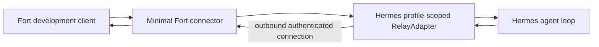

# 051 — Fort as a Messaging Platform for Hermes

**Status:** Local proof connector implemented on 2026-08-23; live Hermes round
trip pending

**Transport ID:** `hermes_platform_relay_v1`

**User-facing name:** `Hermes & <bot display name>`

## Decision

Fort will behave like a messaging platform for Hermes, analogous to Telegram
or Discord. Fort is not a remote execution controller for Hermes.

A thin, profile-scoped connector will let Hermes treat Fort as one of its
messaging platforms. Fort will deliver messages to Hermes through Hermes's
supported relay/platform interface, and Hermes will publish messages back
through the same connector.

Fort owns:

- Fort users and authorization;
- stable Agent and Conversation identity;
- the Fort client experience;
- message addressing and storage;
- connector authentication; and
- delivery between Fort and the enrolled connector.

Hermes owns:

- its provider and model selection;
- its memory and sessions;
- its tools and approvals;
- its agent loop and internal execution policy; and
- the content and timing of its replies.

Provider, model, tool, and policy information may later be displayed as
Hermes-reported metadata. Fort does not attest or enforce those internals for
this messaging transport.

## Question this proof answers

> Can one Hermes bot use Fort as a real messaging platform through Hermes's
> supported relay adapter, without a Fort execution plugin or Hermes core
> patch?

The proof succeeds only if all three actions work through the same thin
connector:

1. a Fort user sends one text message to the Hermes bot;
2. Hermes sends its reply into the same Fort Home Conversation; and
3. Hermes initiates one text message to the configured allowed Fort recipient.

Nothing else is required to answer the question.

## Proof topology



The first proof may run locally on the enrolled Hermes machine. Cloud
production topology remains the intended product direction, but it is not a
prerequisite for proving the messaging seam.

## Thin connector seam

The proof carries only the information needed to route ordinary text messages:

```text
hello
  bindingId
  canonicalProfileId
  botDisplayName

Fort -> Hermes message
  messageId
  conversationId
  senderId
  text

Hermes -> Fort message
  messageId
  conversationId
  text
  optionalInReplyToMessageId
```

The connector translates these envelopes to and from Hermes's released relay
message/action shapes. It does not intercept model calls, tool calls, memory,
or agent-loop lifecycle.

The proof must use one profile-scoped Hermes gateway/adapter process and one
binding. It must never select another profile, bot, machine, native runtime, or
transport as a fallback.

## Identity and presentation

The immutable binding uses Fort's stable Agent ID and the canonical Hermes
profile ID. The Hermes bot display name is presentation only.

Fort displays the option and Conversation participant as:

```text
Hermes & <bot display name>
```

Changing the display name does not change the binding or grant authority.

For the proof, `Hermes ready` means only that the authenticated,
profile-scoped Hermes connector reports itself able to receive Fort messages.
It is Hermes-reported application status, not Fort verification of the active
provider, model, tools, credentials, or downstream services.

## Allowed proactive recipient

Hermes may initiate a proof message only to one configured Fort Home
Conversation.

Hermes's existing generic `allowed_users` settings govern who may speak to a
Hermes bot; they are not an outbound recipient grant. The proof therefore uses
a Fort-specific connector setting containing the stable Fort Conversation ID.
Fort independently confirms that the bound Agent is authorized to post in that
Conversation.

Names, aliases, phone numbers, email addresses, or arbitrary chat IDs are not
valid proof recipients.

## Proof scope

The proof includes:

- one Hermes profile and bot;
- one Fort Agent and canonical Home Conversation;
- one allowed Fort recipient Conversation;
- one thin connector using Hermes's supported relay/platform interface;
- plain UTF-8 text;
- one Fort-to-Hermes message and Hermes reply;
- one Hermes-initiated message;
- the `Hermes & <bot display name>` presentation; and
- enough focused contract coverage to show that the two envelope mappings are
  not hard-coded to the demonstration text.

The proof may reuse existing Fort development authentication and Conversation
storage. It must not introduce a second general ledger or a reusable transport
hierarchy.

## Explicit non-goals

The proof does not implement or claim:

- production readiness;
- FortMac and iOS parity;
- production deployment or enrollment;
- offline delivery guarantees or queue expiry;
- replay, reconnect, crash recovery, or exactly-once transport;
- multiple Hermes profiles or recipients;
- provider, model, tool, memory, or policy attestation;
- Fort-hosted tool approvals;
- turn-completion detection;
- cancellation;
- native Hermes execution, A2A, or Remote Runs;
- attachments, rich media, reactions, edits, deletion, locations, contacts,
  polls, buttons, payments, Web Apps, or other Telegram-like capabilities; or
- migration of the existing local channel-turn tracer.

These are deliberately deferred until the messaging seam is demonstrated.

## Existing Slice 1 tracer

The previously implemented local `core/channelturn` SQLite tracer proved
durable acceptance, accepted-event replay, and idempotent submission. It remains
preserved as historical implementation evidence.

It is not the production messaging architecture and is not extended during
this proof. After the proof, Fort will explicitly decide whether to adapt,
migrate, or remove it. No code or stored data is silently reinterpreted.

## Demonstration

The fresh session should produce one concise, inspectable transcript:

```text
1. The connector reports the enrolled Hermes bot as connected.
2. Fort shows "Hermes & <bot display name>".
3. A Fort user sends a unique benign text message.
4. Hermes receives it through the platform adapter, not native execution.
5. A Hermes reply appears in the same Fort Home Conversation.
6. Hermes sends a second benign text message proactively to the one allowed
   Conversation.
7. Fort displays that proactive message from the same immutable Agent.
```

### Live proof prerequisites (not executed)

The authorized live session must launch one Hermes process under the exact
enrolled profile and map that process to the connector's immutable flags. At
minimum, the profile-scoped Hermes environment must provide:

```text
GATEWAY_RELAY_URL=<the connector endpoint printed by hermes-relay-poc>
GATEWAY_RELAY_ID=<the same value as -gateway-id>
GATEWAY_RELAY_SECRET=<the same secret supplied to the connector as FORT_HERMES_RELAY_SECRET>
GATEWAY_RELAY_PLATFORMS=relay
GATEWAY_RELAY_BOT_IDS={"relay":{"botId":"<the same value as -bot-id>"}}
```

The last two settings are load-bearing in released Hermes: its unstamped
fallback hello uses an empty bot ID, which this exact-identity connector rejects.
The process must be launched under the exact profile:
`hermes --profile <canonical-profile> gateway start`. These prerequisites
describe the future proof; they do not authorize editing the profile, starting
Hermes, or sending a message.

The demonstration must identify which client/test surface was used and which
steps were simulated. A successful envelope-mapping test is not a live Hermes
round trip. A live round trip is not a production-readiness claim.

No live provider message, deployment, service restart, enrollment, or external
tool action is authorized by this document alone. The fresh-session user prompt
must state the exact live actions it authorizes.

## Stop conditions

Stop the proof and report evidence if:

- the released Hermes relay cannot accept a Fort text message without a core
  patch;
- Hermes cannot publish an outbound text message through the supported adapter;
- the adapter cannot stay bound to the exact chosen profile;
- a reply cannot be mapped to the Fort Home Conversation without guessing;
- proactive addressing requires an arbitrary or unbounded recipient; or
- success would require native execution or silent fallback.

Do not solve a failed proof by adding provider/tool interception, a generic
backend hierarchy, a production queue, broad durability machinery, or a Hermes
fork.

## Product direction after a successful proof

The confirmed direction remains:

- Supabase Postgres becomes the canonical production message ledger under the
  cloud product model in Spec 047;
- Fort accepts messages while the connector is offline;
- delivery uses stable message IDs, retry, and deduplication;
- Hermes may initiate messages only to explicitly allowed Fort recipients;
- availability is presented as Hermes-reported readiness;
- FortMac and iOS share the same Conversation record;
- additional content families expand toward Telegram-like breadth through
  explicit capability slices; and
- production acceptance eventually covers two independently bound Hermes bots.

Those decisions guide the next specification checkpoint. They do not enlarge
this proof.

## Result checkpoint

When the proof ends, append a short result to this spec:

- exact Hermes version and adapter seam used;
- whether each of the three required message actions succeeded;
- the smallest blocker if one failed;
- whether any Hermes or Fort production code was changed;
- whether the connector remained thin; and
- the recommendation to proceed, revise the seam, or reject the approach.

Only then should Fort resume production-readiness design.

## Result — local contract proof (2026-08-23)

The proof connector targets Hermes's built-in experimental `relay` platform as
released in Hermes `v2026.8.19` at commit
`fcbd1076a93841fa88855acce810e342a5b78101`. Fort uses contract version `1`,
Hermes's authenticated outbound WebSocket at `/relay`, and the released
`inbound`, `outbound`, and `outbound_result` frames. It does not require a
Hermes plugin, Hermes core patch, or native execution path.

Focused tests use a real local WebSocket peer at the external-system boundary.
They confirm that the connector:

1. sends one Fort text message to the exact enrolled Hermes bot identity;
2. accepts a Hermes reply for the same Fort Home Conversation and returns the
   correlated success result; and
3. accepts a Hermes-initiated text message for the one allowed Conversation,
   while rejecting a different recipient without delivery.

Those are simulated Hermes relay actions, not a live Hermes round trip. No
Hermes instance, model provider, deployed Fort service, desktop client, or
mobile client was contacted during implementation. No service was restarted,
no enrollment or configuration was changed, and no external message was sent.

Fort gained only an isolated proof connector and a disposable terminal
composition. No existing Fort production path or Hermes code was changed. The
connector remains thin: it authenticates the exact gateway, maps ordinary text
frames, presents `Hermes & <bot display name>`, and enforces one exact proactive
recipient. It adds no persistence, retry, replay, execution abstraction,
provider inspection, or transport fallback.

The proof's canonical profile ID is an enrollment mapping to the one Hermes
process launched under that profile and its exact gateway ID and bot ID. Hermes
relay v1 does not attest the profile name on the wire, and this implementation
does not claim that it does.

The recommendation is to proceed to one separately authorized live proof using
the pinned released Hermes contract. The third action must use Hermes's existing
scheduled/routine delivery path: released Hermes does not currently expose an
immediate model-callable `send_message` tool. Passing that live proof would
validate the messaging seam only; it would not establish relay or product
readiness.
